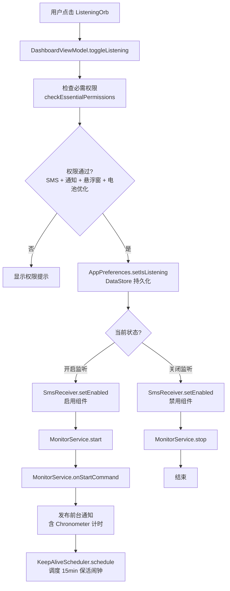
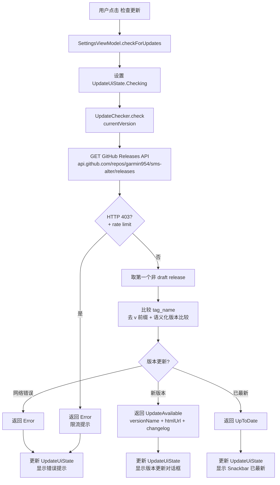
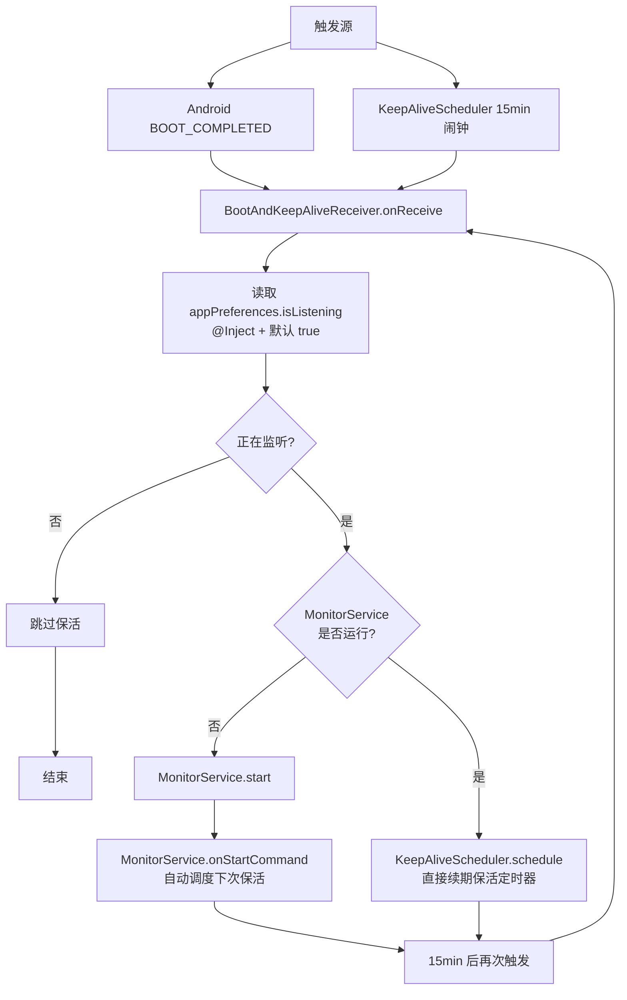

# Pulse — Claude 项目上下文

> 面向 Claude Code 的 Android 项目速查手册。阅读后应能快速定位模块、理解数据流、遵循现有编码规范。

---

## 1. 项目概览

**Pulse** 是一款 Android 短信紧急告警应用。监听 incoming SMS，匹配用户预设关键词后触发全屏报警（声音 + 振动 + 锁屏唤醒 + 系统闹钟兜底）。支持通过 GitHub Releases 检查应用更新。

| 项 | 值 |
|---|---|
| 语言 | Kotlin |
| UI | Jetpack Compose + Material 3 |
| 架构 | MVVM + Hilt DI |
| 构建 | Gradle (Kotlin DSL + Version Catalog) |
| minSdk | 26 (Android 8.0) |
| targetSdk / compileSdk | 35 (Android 14) |
| Kotlin | 1.9.24 |
| AGP | 8.4.0 |
| versionCode / versionName | 3 / 1.0.3 |

---

## 2. 目录结构

```
app/src/main/java/com/example/pulse/
├── SmsAlertApp.kt              # Application 入口，@HiltAndroidApp
├── MainActivity.kt             # 主 Activity：Compose NavHost + 权限引导 + 主题模式
├── AlarmActivity.kt            # 全屏报警 Activity（锁屏唤醒 + KeyguardManager.requestDismissKeyguard() + FLAG_KEEP_SCREEN_ON）
├── LogActivity.kt              # 旧版日志查看 Activity（XML Layout，保留兼容）
├── SmsReceiver.kt              # SMS 广播接收器：解析短信 → 关键词匹配 → 启动 AlertService（含内联 DataStore 去重）
├── SmsReceiverDedup.kt         # 3 秒去重纯逻辑（object 单例，持久化已迁移至 SmsReceiver 内联 DataStore）
├── BootAndKeepAliveReceiver.kt # 开机/保活广播接收器：@AndroidEntryPoint + @Inject AppPreferences
├── KeepAliveScheduler.kt       # 保活调度器：每 15min AlarmManager.setExactAndAllowWhileIdle
├── MonitorService.kt           # 监控前台服务：常驻通知 + Chronometer 计时 + 保活调度
├── AlertService.kt             # 报警前台服务：铃声、振动、WakeLock、启动 AlarmActivity，支持通知栏关闭
├── AlarmReceiver.kt            # 系统闹钟 BroadcastReceiver，AlarmManager 触发作为报警兜底
├── KeywordStore.kt             # DataStore 关键词存储（内存缓存 + DataStore 持久化）
├── LogStore.kt                 # 内存 + 文件日志存储（CopyOnWriteArrayList，上限 500 条，持久化到 filesDir）
├── data/
│   ├── AppDatabase.kt          # Room 数据库定义
│   ├── AppPreferences.kt       # DataStore 偏好（监听开关 + 主题模式 + 更新检查时间 + monitor 计时 + 旧版迁移）
│   ├── UpdateChecker.kt        # GitHub Releases API 更新检查（OkHttp + 限流检测）
│   ├── entity/AlertRecord.kt   # 报警记录实体
│   └── dao/AlertDao.kt         # Room DAO
├── di/
│   └── DatabaseModule.kt       # Hilt 提供 Database / Dao
├── ui/
│   ├── theme/
│   │   ├── Color.kt            # 颜色定义（Light / Dark / Alarm 三Palette）
│   │   ├── Theme.kt            # SmsAlertTheme(themeMode) + AppColors CompositionLocal
│   │   └── Type.kt             # Typography
│   ├── screens/
│   │   ├── DashboardScreen.kt  # 首页：监听球 + 关键词管理 + 测试按钮
│   │   ├── HistoryScreen.kt    # 历史页：报警记录（Room）+ 运行日志（LogStore）
│   │   ├── SettingsScreen.kt   # 设置页：权限状态 + 版本号 + 检查更新 + 主题切换（3 模式 SegmentedButton）
│   │   └── AlarmScreen.kt      # 全屏报警 Compose UI（20s 倒计时 + 确认时取消）
│   └── components/
│       ├── ListeningOrb.kt     # 监听状态球（呼吸动画 + 水波纹）
│       ├── KeywordCard.kt      # 关键词输入 + Chip 列表
│       ├── StatusCard.kt       # 权限状态卡片（含 checkAllPermissions / checkEssentialPermissions）
│       └── BottomNavBar.kt     # 底部导航栏
└── viewmodel/
    ├── DashboardViewModel.kt   # 监听开关、关键词 CRUD、测试报警（注入 AppPreferences + KeywordStore）
    ├── HistoryViewModel.kt     # 日志 / 报警记录查询、统计
    └── SettingsViewModel.kt    # 权限状态刷新 + 更新检查 + 主题模式管理 + UpdateUiState
```

---

## 3. 核心数据流

### 3.1 报警触发链路

```mermaid
flowchart TB
    A[Incoming SMS] --> B[SmsReceiver.onReceive]
    B --> C[解析短信内容<br/>Telephony.Sms.Intents.getMessagesFromIntent]
    C --> D[获取关键词列表]
    D --> D1[优先: KeywordStore.getInstance<br/>内存缓存同步读取]
    D --> D2[兜底: loadKeywordsFallback<br/>SharedPreferences + 默认值]
    D1 --> E[步骤1: 关键词匹配<br/>matchKeywords 大小写不敏感]
    D2 --> E
    E --> F{匹配成功?}
    F -- 否 --> G[结束]
    F -- 是 --> H[步骤2: 去重检查<br/>3s 窗口]
    H --> H1[loadDedupData<br/>runBlocking 读取 DataStore]
    H1 --> H2[SmsReceiverDedup.isDuplicate<br/>内容+时间戳比对]
    H2 --> H3{是重复?}
    H3 -- 是 --> G
    H3 -- 否 --> I[saveDedupData<br/>runBlocking 写入 DataStore]
    I --> J[步骤3: 获取临时 WakeLock<br/>PARTIAL_WAKE_LOCK 5s]
    J --> K[步骤4: startForegroundService<br/>AlertService]
    K --> L[AlertService.onStartCommand]
    L --> M[保存 AlertRecord 到 Room]
    M --> N[acquireWakeLock<br/>PARTIAL_WAKE_LOCK 60s]
    N --> O[triggerAlarm<br/>循环振动 + 循环铃声]
    O --> P[startForeground<br/>高优先级通知 + FullScreenIntent]
    P --> Q[startActivity<br/>AlarmActivity]
    Q --> R[AlarmScreen UI]
    R --> S[20s 倒计时]
    S --> T{用户操作?}
    T -- 点击确认 --> U[停止 AlertService → dismiss]
    T -- 通知栏关闭 --> V[AlertService 接收 ACTION_DISMISS<br/>发送 ACTION_FINISH_ACTIVITY → 关闭]
    T -- 倒计时归零 --> X[停止 AlertService<br/>显示"警报已超时"]
    U --> W[关闭 Activity]
    V --> W
```

### 3.2 监听控制链路



### 3.3 更新检查链路



### 3.4 保活与进程复活链路



---

## 4. 关键模块详解

### 4.1 SmsReceiver

- `exported="true"`，`priority="1000"` 确保高优先级接收。
- 通过 `PackageManager.setComponentEnabledSetting` 动态启用/禁用，避免未开启监听时占用资源。
- **去重机制**：
  - 去重窗口：**3 秒**，基于内容完全匹配 + 时间戳。
  - 纯逻辑位于 `SmsReceiverDedup.isDuplicate()`（object 单例，仅数学比较）。
  - 持久化存储位于 `SmsReceiver.kt` 文件级 `Context.dedupDataStore`（DataStore，name=`sms_dedup_prefs`）。
  - `loadDedupData(context)` / `saveDedupData(context, body, time)` 通过 `runBlocking` 同步读写。
- **onReceive 四步处理流程**（每步均有 LogStore 日志）：
  1. 关键词匹配（`matchKeywords`，大小写不敏感）
  2. 去重检查（加载上次数据 → `SmsReceiverDedup.isDuplicate()` → 保存本次数据）
  3. 获取临时 `PARTIAL_WAKE_LOCK`（5s 超时），防止 CPU 在启动 Service 前休眠
  4. `startForegroundService(AlertService)`
- **双轨关键词机制**：
  - 优先路径：`KeywordStore.getInstance()?.getKeywords()`（Hilt `@Singleton`，内存缓存）。
  - 兜底路径：当 `getInstance()` 返回 null（Hilt 懒加载尚未完成），回退到 `loadKeywordsFallback(prefs)`，接收 `SharedPreferences` 参数，若为空则使用内置 **非空默认值**：`listOf("ALERT", "紧急", "交警", "服务器宕机")`。
  - `matchKeywords()` 和 `loadKeywordsFallback()` 均为 `internal` 可见性。
  - 注意：KeywordStore 本身的 `DEFAULT_KEYWORDS` 是空列表，两者默认值不同。

### 4.2 AlertService

- 前台服务类型：`specialUse`，子类型 `urgent_sms_alert`。
- 振动模式：长数组循环 `VibrationEffect.createWaveform(pattern, 0)`。
- 铃声：`RingtoneManager.TYPE_ALARM`，`isLooping = true`。
- WakeLock：`PARTIAL_WAKE_LOCK | ACQUIRE_CAUSES_WAKEUP | ON_AFTER_RELEASE`，60 秒超时，`setReferenceCounted(false)`。
  - 注意：虽然注释说"屏幕唤醒由 AlarmActivity 处理，Service 只需保持 CPU"，但实际代码仍使用了 `ACQUIRE_CAUSES_WAKEUP`，这意味着 Service 层面也会唤醒屏幕，与注释矛盾。建议二选一。
- **通知栏关闭按钮**：发送 `ACTION_DISMISS` Intent → AlertService 收到后广播 `ACTION_FINISH_ACTIVITY` 通知 AlarmActivity 关闭。
- 通知已 `setFullScreenIntent(pendingIntent, true)`，确保锁屏时也能全屏弹出。
- 服务销毁时自动停止铃声、取消振动、释放 WakeLock、取消协程作用域。

### 4.3 AlarmScreen 倒计时

- 常量：`COUNTDOWN_SECONDS = 20`（UI 倒计时）。
- **用户点击确认**（`dismissWithCancel`）：停止 AlertService → `onDismiss()` 关闭 Activity。
- **用户未操作**：20s 倒计时归零 → 停止 AlertService → 界面保持显示，显示"警报已超时"。

### 4.4 MonitorService

- 前台服务类型：`specialUse`，子类型 `sms_monitoring`。
- **计时机制**：使用 `SystemClock.elapsedRealtime()` 记录启动时间戳，通过 `AppPreferences` 的 `saveMonitorStartTime()` / `getMonitorStartTime()` / `clearMonitorStartTime()` 持久化到 DataStore（兼容旧版 SharedPreferences `monitor_prefs`）。注意：设备重启后 `elapsedRealtime` 归零，旧值将被抛弃。
- **通知计时**：使用 `setUsesChronometer(true)` + `setWhen(whenTime)` 让系统自动管理计时器显示（非自行每秒更新）。
- `START_STICKY` 确保系统尽量重启服务。
- 静态 `isRunning()` / `getElapsedMs()` 供外部查询运行状态和已运行时长。
- `start()` / `stop()` 静态方法封装 `startForegroundService` / `stopService` 调用，含异常保护。
- **保活集成**：`onStartCommand()` 中调用 `KeepAliveScheduler.schedule(this)`，`onDestroy()` 中调用 `KeepAliveScheduler.cancel(this)`。

### 4.5 KeywordStore

- 架构：Hilt `@Singleton`，通过 `companion object` 维护实例引用供非 Hilt 组件（如 SmsReceiver）访问。
- 兼容旧版 `##` 分隔符格式，读取时自动迁移。
- 内存缓存：`@Volatile cachedKeywords` 实现同步读取，`match()` 和 `getKeywords()` 无需挂起。
- **初始化**：在 `init` 中使用 `runBlocking` 同步加载 DataStore（优先）或旧 SharedPreferences（首次迁移），确保 `SmsAlertApp.onCreate()` 调用 `getKeywords()` 时完整数据已就绪，消除 SmsReceiver 读到过期缓存的竞态条件。
- 旧版兼容：首次启动时自动从旧 SharedPreferences `sms_alert_prefs.keywords` 迁移到 DataStore。
- 限制：最多 50 条，单条最长 50 字符。
- 默认关键词：**空列表**（首次安装无预设关键词）。
- ⚠ 注意：SmsReceiver 中有独立的 `DEFAULT_KEYWORDS = listOf("ALERT", "紧急", "交警", "服务器宕机")` 作为 Hilt 未就绪时的兜底，两者默认值不同。

### 4.6 LogStore

- 线程安全：`CopyOnWriteArrayList<String>`，上限 500 条，超出时移除末尾。
- **文件持久化**：日志同时写入 `filesDir/pulse_events.log`（上限 200KB，超出时截断保留末尾 500 行）。进程重启后通过 `init()` 从文件恢复上一进程日志。
- 提供 `SharedFlow<Unit>` 事件流，供 UI 订阅刷新。
- 日志格式：`[HH:mm:ss] [D/I/W/E] message`。
- `init(Context)` 须在 `Application.onCreate()` 中最先调用，否则文件日志不生效。

### 4.7 UpdateChecker

- 位于 `data/UpdateChecker.kt`，`object` 单例。
- 调用 GitHub Releases API（`garmin954/sms-alter`），过滤 draft。
- **网络层**：使用 **OkHttp**（`OkHttpClient`），连接/读/写超时各 10s，替代原始 `HttpURLConnection`。
- **GitHub API 限流检测**：HTTP 403 + body 含 "rate limit" 时返回 `Error("GitHub API 限流，请稍后再试")`，避免无提示卡死。
- `isVersionNewer()` 按语义化版本号逐段比较（`x.y.z`）。
- 返回 sealed class `UpdateResult`：`UpdateAvailable`（含 versionName / htmlUrl / changelog）、`UpToDate`、`Error`。

### 4.8 AppPreferences

- DataStore 存储，key：`is_listening`（Boolean）、`theme_mode`（Int，0=跟随系统/1=浅色/2=深色）、`last_update_check`（Long）、`monitor_start_time`（Long）。
- 旧版迁移：`is_listening` 从旧 `sms_alert_prefs` 迁移（默认 `true`）；`monitor_start_time` 从旧 `monitor_prefs` 迁移。
- `themeMode: Flow<Int>` 默认值 0，通过 `setThemeMode(mode: Int)` 修改。
- `saveMonitorStartTime(value)` / `getMonitorStartTime()` / `clearMonitorStartTime()` 供 MonitorService 管理计时持久化。
- 通过 Hilt `@Singleton` 注入。

---

## 5. 编码规范

### 5.1 命名

| 类型 | 规范 | 示例 |
|---|---|---|
| 类 | PascalCase | `AlertService`, `DashboardViewModel` |
| 函数 / 变量 | camelCase | `toggleListening()`, `isListening` |
| 常量 | UPPER_SNAKE_CASE | `COUNTDOWN_SECONDS`, `CHANNEL_ID` |
| Compose 函数 | PascalCase | `ListeningOrb()`, `AlarmScreen()` |
| 资源字符串 | snake_case | `R.string.test_alarm_button` |

### 5.2 Compose 规范

- 使用 `LocalAppColors.current` 获取主题色，**不要**直接硬编码 `Color(...)`。
- Screen 级 Composable 接收 `modifier: Modifier = Modifier` 参数并优先应用。
- ViewModel 通过 `hiltViewModel()` 获取，不要在 Composable 中直接操作 Context 做 IO。
- 动画使用 `rememberInfiniteTransition` + `animateFloat`，指定 `label` 参数。
- 主题使用 `SmsAlertTheme(themeMode: Int = 0)` 包裹，`themeMode` 从 `AppPreferences.themeMode` 获取，支持三模式切换（0=系统/1=浅色/2=深色）。

### 5.3 协程与生命周期

- ViewModel 中使用 `viewModelScope`。
- Service 中自建 `CoroutineScope(Dispatchers.IO)`，在 `onDestroy` 中 `cancel()`。
- Flow 收集使用 `.stateIn(viewModelScope, SharingStarted.WhileSubscribed(5000), initial)`。

### 5.4 权限

- 运行时权限统一在 `MainActivity.requestRuntimePermissions()` 中申请。
- 权限检查辅助函数位于 `StatusCard.kt`：
  - `checkEssentialPermissions()` — 监听开启前检查（SMS + 通知 + 悬浮窗 + 电池优化）。
    - ⚠ **不含** `SCHEDULE_EXACT_ALARM` / `USE_EXACT_ALARM`，这意味着兜底 `AlarmManager.setExact` 可能在 Android 12+ 上静默降级为 `setWindow`，无任何提示。
  - `checkAllPermissions()` — 设置页展示完整权限清单（含厂商手动权限 + 精确闹钟权限）。
- `MainActivity.openPermissionSetting(type)` 路由表：`sms` / `notification` / `battery` / `overlay` / `autostart` / `lockscreen` / `bgpopup` / `alarm`。
  - `autostart`：根据厂商（Xiaomi/OPPO/vivo/Huawei/Samsung）尝试跳转对应自启动管理页，均失败则回退到应用详情页。
  - `alarm`：Android 12+ 跳转 `ACTION_REQUEST_SCHEDULE_EXACT_ALARM`，低版本回退到应用详情页。
  - `lockscreen`：跳转通知渠道设置 → 应用通知设置 → 应用详情（三级回退）。

---

## 6. 构建与 CI

### 6.1 依赖管理

- 使用 **Version Catalog**（`gradle/libs.versions.toml`）集中管理所有依赖版本。
- 构建脚本为 **Kotlin DSL**（`.kts`），类型安全。
- 添加新依赖时在 `gradle/libs.versions.toml` 中声明版本和库，在 `app/build.gradle.kts` 中通过 `libs.*` 访问器引用。

### 6.2 本地构建

```bash
# 调试 APK
./gradlew :app:assembleDebug

# 发布 APK（R8 混淆 + 资源压缩）
./gradlew :app:assembleRelease

# Lint + 单元测试
./gradlew :app:lintDebug :app:testDebugUnitTest
```

### 6.3 CI (GitHub Actions)

- 触发：`push` / `pull_request` 到 `main`。
- Build 工作流：Lint → Unit Tests → Debug APK → Release APK → 上传产物。
- Release 工作流：tag push 时自动构建签名 Release APK 并创建 GitHub Release。
- JDK 17 + Gradle 缓存。

### 6.4 签名

- Release 构建从 `local.properties` 或环境变量读取签名配置（`RELEASE_KEYSTORE_FILE` / `RELEASE_KEYSTORE_PASSWORD` / `RELEASE_KEY_ALIAS` / `RELEASE_KEY_PASSWORD`）。
- 未配置签名时跳过签名步骤。

---

## 7. 常见修改场景

### 7.1 修改关键词默认项

关键词存在两个独立的默认值位置，修改时需同时考虑：
- `KeywordStore.kt` 中 `DEFAULT_KEYWORDS`（当前为空列表，控制 UI 看到的初始值）。
- `SmsReceiver.kt` 中 `DEFAULT_KEYWORDS`（当前为 `listOf("ALERT", "紧急", "交警", "服务器宕机")`，控制 Hilt 未就绪时 `loadKeywordsFallback()` 的兜底匹配值）。
- 建议统一为一个数据源。

### 7.2 调整报警倒计时

修改 `AlarmScreen.kt` 中 `COUNTDOWN_SECONDS` 常量（默认 20s）。

### 7.3 修改报警铃声

修改 `AlertService.triggerAlarm()` 中 `RingtoneManager.getDefaultUri(...)` 的 type，或替换为自定义 Uri。

### 7.4 新增 Room 实体 / 迁移

1. 在 `data/entity/` 下新增实体。
2. 更新 `AppDatabase.kt` 的 `entities` 数组和 `version`。
3. 如需迁移，添加 `Migration` 并在 `DatabaseModule` 的 `Room.databaseBuilder` 中 `.addMigrations(...)`。

### 7.5 新增权限

1. `AndroidManifest.xml` 添加 `<uses-permission>`。
2. `StatusCard.kt` 的 `checkAllPermissions()` / `checkEssentialPermissions()` 中增加检查逻辑。
3. `MainActivity.openPermissionSetting()` 中增加跳转分支。
4. `strings.xml` 添加对应文案。

### 7.6 修改更新检查源

修改 `UpdateChecker.kt` 中的 `GITHUB_API_URL` 常量。

### 7.7 修改保活间隔

修改 `KeepAliveScheduler.kt` 中的 `INTERVAL_MS` 常量（默认 15 分钟）。

### 7.8 修改主题模式

- `AppPreferences.kt` 中 `KEY_THEME_MODE` 定义 DataStore key（Int，0=跟随系统/1=浅色/2=深色）。
- `Theme.kt` 中 `SmsAlertTheme(themeMode)` 根据 mode 选择对应 ColorScheme 和 AppColors。
- `SettingsScreen.kt` 中 `SingleChoiceSegmentedButtonRow` 提供三模式 UI 切换。
- `SettingsViewModel.kt` 中 `setThemeMode(mode)` 持久化用户选择。

---

## 8. 注意事项

- **AlarmScreen 20s 倒计时**：用户确认或倒计时归零后自动停止 AlertService 并关闭报警界面。
- **MonitorService 计时持久化**：使用 `SystemClock.elapsedRealtime()` + `AppPreferences` 的 `saveMonitorStartTime()` / `getMonitorStartTime()` 持久化启动时间，进程重启后可恢复计时（兼容旧版 `monitor_prefs`）。设备重启后 `elapsedRealtime` 归零，旧值被抛弃。
- **保活机制**：`KeepAliveScheduler` 每 15min 通过 `AlarmManager.setExactAndAllowWhileIdle` 触发 `BootAndKeepAliveReceiver`，若监听开启且 MonitorService 未运行则自动重启并调度下次保活；若已在运行则直接续期保活定时器。此机制与 MonitorService 绑定，关闭监听后不再调度。
- **厂商权限**：自启动、后台弹出界面、锁屏显示等无法通过标准 API 检测，设置页中标记为"需手动设置"并引导用户跳转。`MainActivity.openAutoStartSettings()` 根据厂商（Xiaomi/OPPO/vivo/Huawei/Samsung）尝试跳转对应自启动管理页。
- **SmsReceiver 动态启用**：首次安装后默认启用（`MainActivity.onCreate` 从 `appPreferences.isListening` 读取并应用），用户关闭监听后会禁用组件，重新开启时恢复。
- **LogActivity 为旧版 XML 实现**：新功能优先使用 Compose（HistoryScreen），LogActivity 保留用于调试兼容。
- **ProGuard**：Release 构建启用 R8 + `shrinkResources`，Room 实体和 Hilt 模块已受注解保护，无需额外规则。
- **AppPreferences 兼容迁移**：`is_listening` 读取时自动从旧 SharedPreferences (`sms_alert_prefs`) 迁移，旧版数据不会丢失。
- **KeywordStore 初始化时序**：`init` 中使用 `runBlocking` 同步加载 DataStore，确保 `SmsAlertApp.onCreate()` 调用 `getKeywords()` 时完整关键词列表已就绪，消除此前同步读旧 SharedPreferences + 异步读 DataStore 的竞态条件。
- **精确闹钟权限**：`checkEssentialPermissions()` 未检查 `SCHEDULE_EXACT_ALARM`，Android 12+ 上若用户拒绝，兜底 `AlarmManager.setExact` 静默降级为 `setWindow`，延迟可能从 15s 变为数分钟。
- **BootAndKeepAliveReceiver 使用 Hilt**：该 Receiver 声明在 Manifest 中（`@AndroidEntryPoint`），通过 `@Inject` 获取 `AppPreferences`，依赖 Hilt 在 Application 启动时完成初始化。若进程刚启动即收到 BOOT_COMPLETED，存在极低概率的注入未就绪风险。
- **SmsReceiver 去重存储**：去重持久化已从 `SmsReceiverDedup` 迁移至 `SmsReceiver.kt` 文件级 `Context.dedupDataStore`（`preferencesDataStore` 委托），SmsReceiverDedup 现为纯逻辑 object。两者通过 `loadDedupData()` / `saveDedupData()` 桥接，均使用 `runBlocking` 同步读写。
- **SmsReceiver 临时 WakeLock**：`onReceive` 在启动 AlertService 前获取 5s `PARTIAL_WAKE_LOCK`，防止 CPU 在广播返回后、Service 启动前休眠导致报警延迟或丢失。
