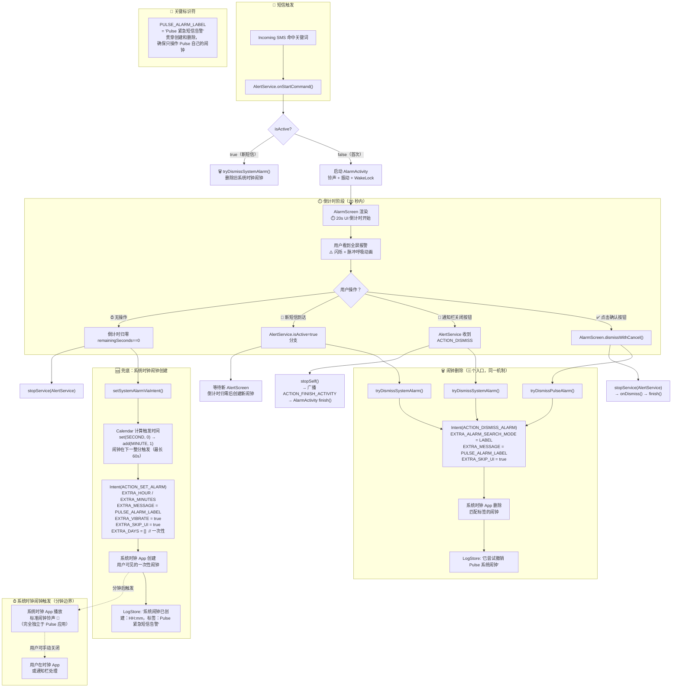
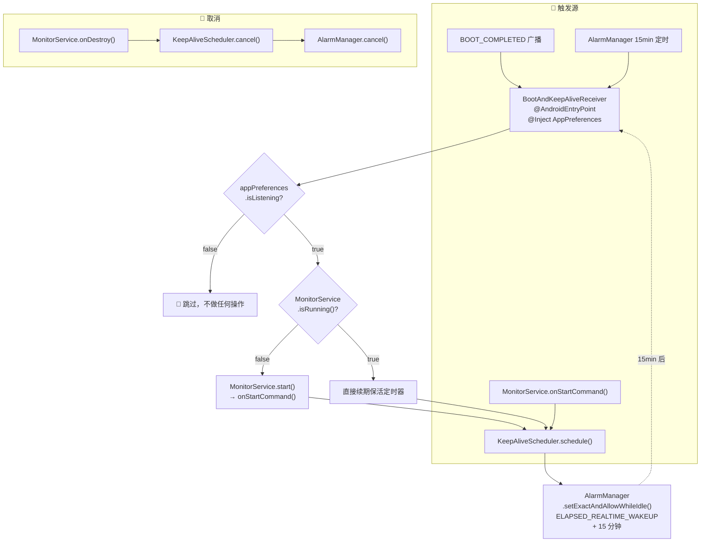

# Pulse 系统闹钟流程图

## 路径 B：系统时钟闹钟兜底（完整流程）



## 路径 A：AlarmManager 保活（独立机制，与报警无关）



## 对比总结

| 维度 | 路径 A：AlarmManager 保活 | 路径 B：系统时钟闹钟兜底 |
|---|---|---|
| **API** | `AlarmManager.setExactAndAllowWhileIdle` | `AlarmClock.ACTION_SET_ALARM` |
| **接收方** | `BootAndKeepAliveReceiver`（应用内） | 系统时钟 App（应用外） |
| **目的** | 保持 MonitorService 进程存活 | 确保用户最终收到告警 |
| **精度** | 毫秒级（精确唤醒） | 分钟级（分钟边界触发） |
| **用户可见** | 不可见 | 系统时钟 App 中可见 |
| **间隔** | 每 15 分钟重复 | 一次性（`EXTRA_DAYS=[]`） |
| **唯一标识** | 请求码 `9001` | 标签 `PULSE_ALARM_LABEL` |

## 系统闹钟创建逻辑（已修复）

[AlarmScreen.kt](app/src/main/java/com/example/pulse/ui/screens/AlarmScreen.kt)

```kotlin
val calendar = Calendar.getInstance().apply {
    set(Calendar.SECOND, 0)
    add(Calendar.MINUTE, 1)
}
```

去掉了原来的 `+15s` 缓冲和 `if (SECOND > 0)` 条件分支，直接取当前时间的下一整分。`ACTION_SET_ALARM` 只支持分钟精度，最坏情况延迟 60 秒。
